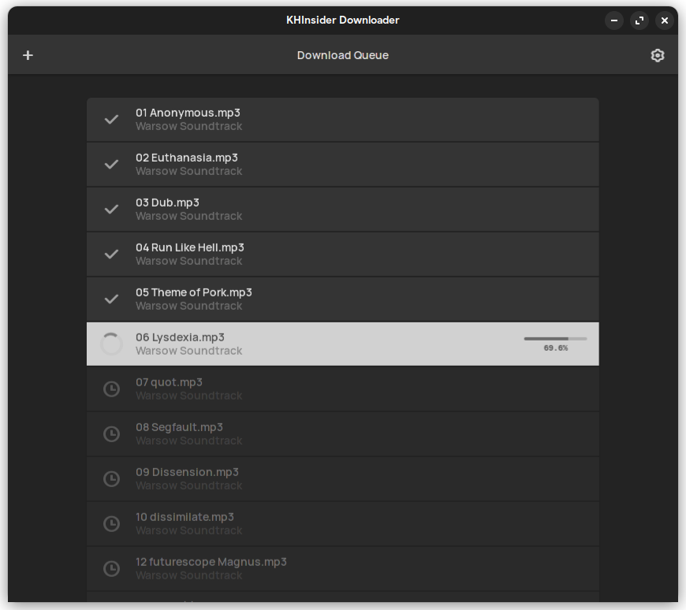

# KHInsider Downloader


# Development
To build UI and run Photino in one command execute the following in a terminal.

```sh
# From inside root folder execute:
# `npm run build` will update the
# wwwroot folder after build is complete. 
cd UserInterface && npm run dev
```

# Build
## Flatpak
### Prerequisites
- org.freedesktop.Platform//23.08
- org.freedesktop.Sdk//23.08
- org.freedesktop.Sdk.Extension.dotnet8//23.08

### Commands
- ``npm run build``
- ``dotnet publish KHID.UI``
- ``flatpak-builder Build --force-clean flatpak/media.laura.khid.json``
- **Testing**: ``flatpak-builder --run Build flatpak/media.laura.khid.json KHID.UI``